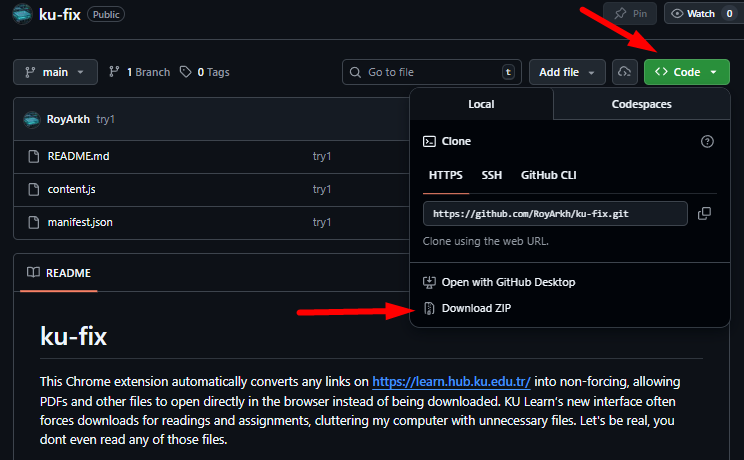
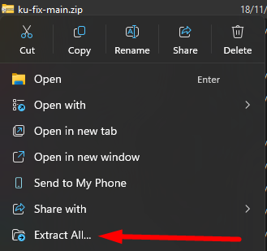
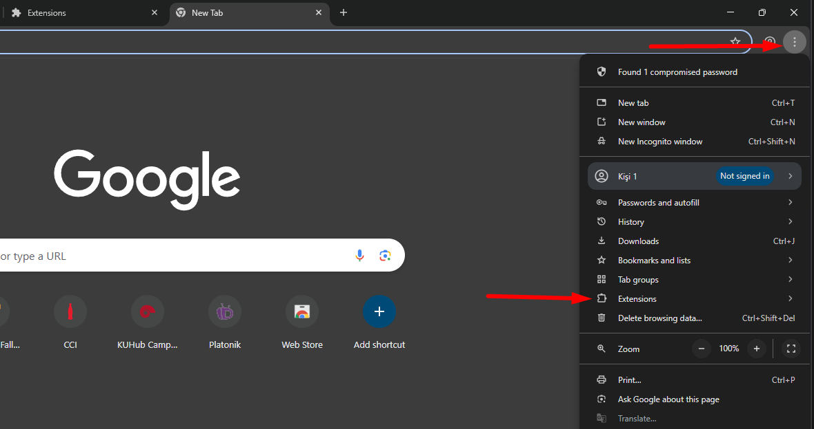
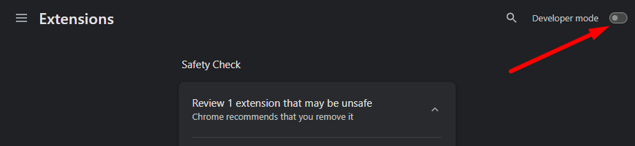
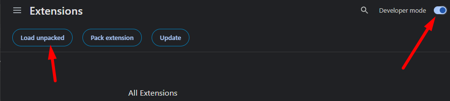
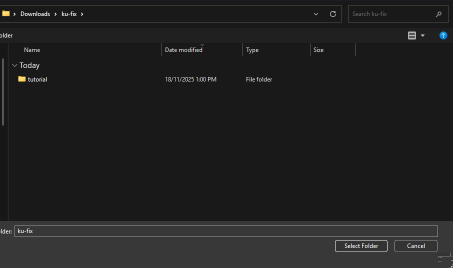
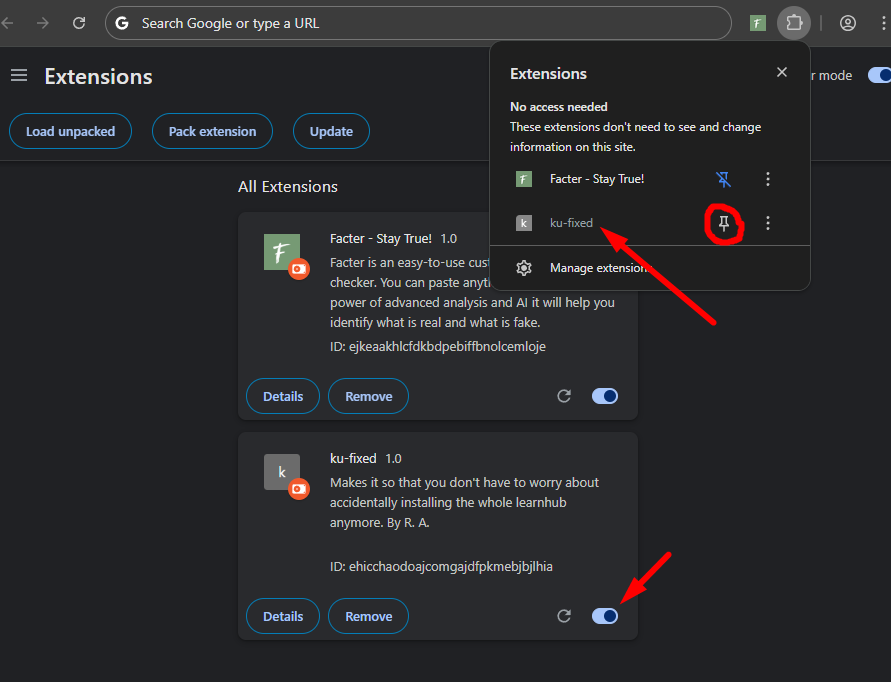

# ku-fix

This Chrome extension automatically converts any links on **https://learn.hub.ku.edu.tr/** into non-forcing, allowing PDFs and other files to open directly in the browser instead of being downloaded. KU Learn’s new interface often forces downloads for readings and assignments, cluttering my computer with unnecessary files. Let's be real, you dont even read any of those files.

---

## 🚀 Installation

Follow these steps to install the manually:

### 1. Download the project
Clone or download this repository to your computer from this page. Click on "Code" and then "Download ZIP".

### 2. Unzip
Go to your downloads and unzip the folder. After you unzip the folder either keep it in the Downloads or you might want to move it to a more permanent location, like your desktop.

### 3. Go to Chrome, manage extensions
Now open Chrome. There you need to go to the top right, click on 3 dots, then click on "Extensions" and click "Manage Extensions"

### 4. Dev Mode

Turn on Developer mode on the top right.

### 5. Load Extension

After Developer mode is ON click on Load Unpacked on the top left. This will ask you to find the location of the folder.

Find your folder (it should show the tutorial folder inside but do not press on the tutorial folder) and then click Select Folder.

### 6. Enjoy your extension

Now you should see the extension along other extensions you might have. Make sure that it's turned on. Alternatively, you can pin it on the top right.

